# 🤖 IOT UPLOADER

<div align="center">


[Demo Bot](https://t.me/iotuploaderbot) | [Documentation](#documentation) | [Setup Guide](#setup) | [Contributing](#contributing)


</div>

## ✨ Features

- 🚀 **Lightning Fast** file uploads and downloads
- 🔐 **Secure** user verification through channel membership
- ⏰ **Auto-deletion** of sensitive messages
- 👑 **Admin Dashboard** for content management
- 🗄️ **Persistent Storage** with MySQL
- 🌐 **WSGI Ready** for production deployment

## 🔄 How It Works

```mermaid title="Bot Workflow" type="diagram"
graph TD
    A["🤖 Bot Start"] -->|"User Sends File"| B["Admin Processing"]
    B -->|"Generate Link"| C["Unique Download Link"]
    D["User Clicks Link"] -->|"Verify Channel Membership"| E["Channel Check"]
    E -->|"Not Member"| F["Show Join Request"]
    E -->|"Is Member"| G["Deliver File"]
    G -->|"Auto Delete"| H["Message Removed"]
    F -->|"User Joins"| G

```



## 🛠️ Prerequisites

- Python 3.9 or higher
- MySQL Server
- Active Telegram Bot Token
- SSL Certificate (for webhook)


## 📦 Installation

1. **Clone the Repository**

```shellscript
git clone https://github.com/YourUsername/IOTAnswerBot.git
cd IOTAnswerBot
```


2. **Install Dependencies**

```shellscript
pip install -r requirements.txt
```


3. **Configure Environment**

```python
# config.py
TOKEN = "your-telegram-bot-token"
DB_CONFIG = {
    'user': 'your_db_user',
    'password': 'your_db_password',
    'host': 'localhost',
    'database': 'iot_bot'
}
```

## 🚀 Deployment

```mermaid
graph LR
    A["📱 Telegram"] -->|"HTTPS"| B["Nginx Proxy"]
    B -->|"Forward"| C["Gunicorn"]
    C -->|"WSGI"| D["Flask App"]
    D -->|"Query"| E["MySQL DB"]

    style A fill:#f9f,stroke:#333
    style B fill:#bbf,stroke:#333
    style C fill:#bfb,stroke:#333
    style D fill:#fbf,stroke:#333
    style E fill:#ff9,stroke:#333

    %% Define a class for white text color
    classDef whiteText fill:#000,stroke:#333,color:#fff

    %% Apply white text class to nodes
    class A,B,C,D,E whiteText
```



1. **Set Up WSGI Server**

```shellscript
gunicorn --bind 0.0.0.0:8000 app:app
```


2. **Configure Nginx**

```plaintext
server {
    listen 443 ssl;
    server_name your-domain.com;
    
    location / {
        proxy_pass http://127.0.0.1:8000;
    }
}
```


3. **Initialize Database**

```shellscript
python main.py
```


## 🔒 Security Features

- 🛡️ **Message Auto-Destruction**: Sensitive content automatically deleted
- 🔑 **Channel Verification**: Users must join specified channels
- 🔐 **Admin Controls**: Restricted file upload capabilities
- 📝 **Logging**: Comprehensive error and activity logging


## 🤝 Contributing

We welcome contributions! Please follow these steps:

1. Fork the repository
2. Create your feature branch (`git checkout -b feature/AmazingFeature`)
3. Commit your changes (`git commit -m 'Add some AmazingFeature'`)
4. Push to the branch (`git push origin feature/AmazingFeature`)
5. Open a Pull Request


## 📄 License

This project is licensed under the MIT License - see the [LICENSE](LICENSE) file for details.

## 🙏 Acknowledgments

- [python-telegram-bot](https://python-telegram-bot.org/) community
- [Flask](https://flask.palletsprojects.com/) framework
- All our amazing contributors


## 📚 Documentation

### Project Structure

```plaintext
IOTAnswerBot/
│
├── app.py            # Main Flask app and bot logic
├── config.py         # Configuration settings
├── main.py           # Database setup and webhook configuration
├── requirements.txt  # Project dependencies
└── README.md         # This file
```

### Core Components

#### `app.py`

This file contains the main bot logic, including:

- Handling incoming webhook requests
- Processing messages and file uploads
- Checking user channel membership
- Sending and deleting messages
- Managing admin access


#### `config.py`

Configuration file containing:

- Telegram bot token
- Database connection settings
- Required channel settings
- Other configuration parameters


#### `main.py`

This script is used for initial project setup:

- Creating database tables
- Setting up the webhook for the bot


### Usage Instructions

1. **File Upload (Admins Only)**

1. Send a file to the bot
2. Bot generates a unique download link


2. **File Download (Users)**

1. Click on the download link
2. Join required channels if necessary
3. Receive the file (message with file will be deleted after a set time)


3. **Management (Admins)**

1. Upload and delete files
2. View usage statistics
3. Configure bot parameters


## 🛠️ Troubleshooting

- **Database Connection Error**: Ensure MySQL is running and `config.py` settings are correct.
- **Webhook Setup Issue**: Verify domain address and SSL certificate.
- **Message Deletion Error**: Check if the bot has sufficient permissions in the group or channel.


For other issues, please open an Issue on GitHub.

## 🔮 Future Enhancements

1. **Multi-language Support**: Implement language selection for bot interactions.
2. **File Compression**: Add option to compress large files before sending.
3. **User Analytics**: Implement detailed usage analytics for admins.
4. **Scheduled Messages**: Allow admins to schedule message broadcasts.
5. **Integration with Cloud Storage**: Option to store files on cloud platforms.


## 📊 Performance Metrics


## 🔧 Advanced Configuration

For advanced users, the bot offers additional configuration options:

1. **Custom Filters**: Implement your own message filters in `app.py`.
2. **Webhook Customization**: Modify webhook behavior in `main.py`.
3. **Database Optimization**: Fine-tune MySQL queries for better performance.


## 📈 Scaling the Bot

As your user base grows, consider these scaling strategies:

1. **Load Balancing**: Implement a load balancer to distribute incoming webhook requests.
2. **Database Sharding**: Partition the database to handle increased data volume.
3. **Caching Layer**: Implement Redis or Memcached to reduce database load.
4. **Microservices Architecture**: Split bot functionalities into separate services for better scalability.


## 🤖 Bot Commands

Here's a list of available bot commands:

- `/start` - Initialize the bot


## 🎨 Customization

You can customize the bot's appearance and behavior:

1. **Custom Welcome Messages**: Edit welcome messages in `config.py`.
2. **Branded Visuals**: Add your logo and brand colors to bot responses.
3. **Custom Keyboard Layouts**: Design custom keyboard layouts for specific commands.

## 💸 Support This Project

If you found this project helpful and would like to support its development, you can make a contribution via TON at the following address:

**TON Address**: `alirezajahani.ton`
